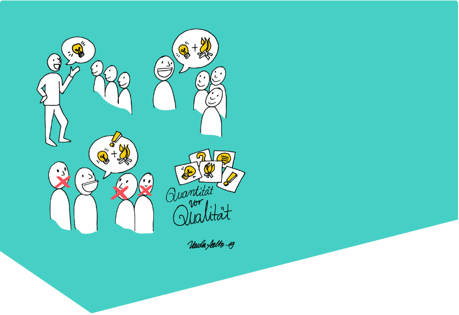
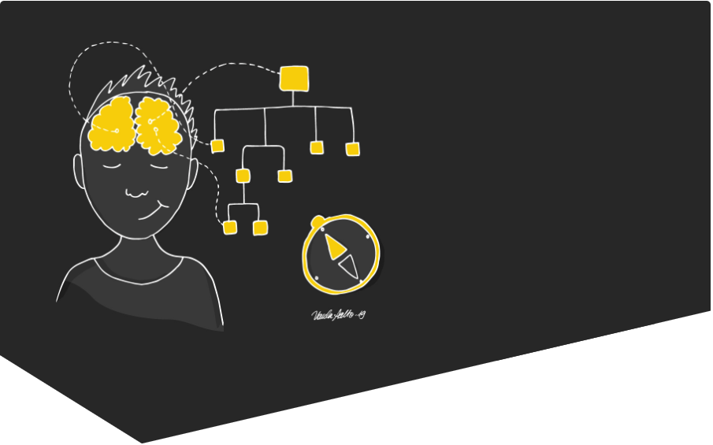
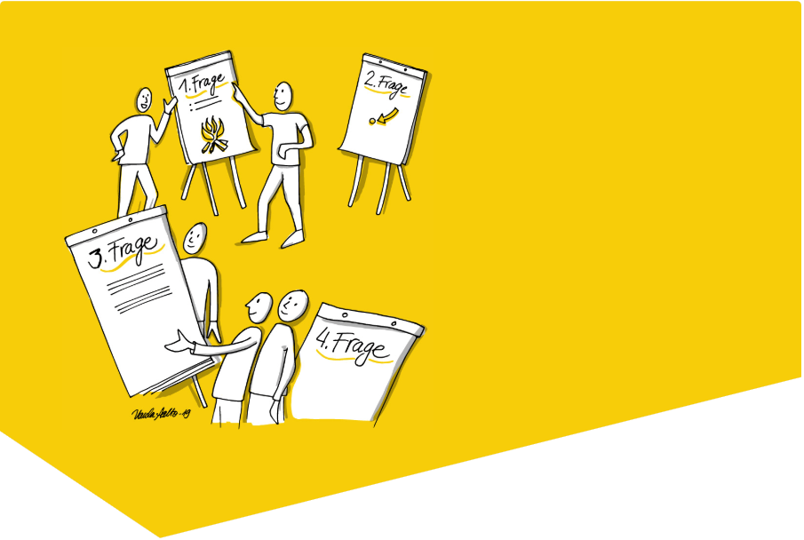
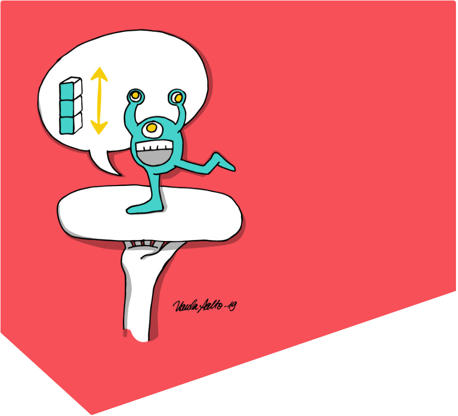

## Ja+Und Brainstorming
Problemstellung ist oft noch nicht klar. Eine reine Ideenfindung steht im Vordergrund. Es geht um Ideenfluss und Querdenken, frei von Konventionen:

1. Jeder notiert möglichst viele Ideen auf Klebezettel.
1. Die Ideen werden gemeinsam betrachtet und nicht kritisiert.
1. Die Ideen werden nach Belieben ausgebaut, geclustert, ergänzt, kombiniert.
1. Die Ideen werden gemeinsam bewertet.

Wichtig: Alles ist richtig, Quantität statt Qualität, Querdenken und unrealistisches Fantasieren sind erlaubt. Varianten Tipp: Zeitreisen Brainstorming: Man fragt sich wie die Problemstellung vor oder in 10, 100 oder 1000 Jahren gelöst wurde oder wird.

## Mind-Mapping
Wenn Problem oder Aufgabenstellung schon etwas klarer sind. Alle Abhängigkeiten werden in Struktur gebracht und aufgedeckt:

1. Gedanken Ideen werden analog einem Brainstorming auf Klebezettel oder direkt auf dem Whitebord notiert.
1. Die Gedanken werden sofort in Beziehung zueinander gestellt.
1. Die Cluster werden sofort gemeinsam konsolidiert.

Eignet sich in kleineren Gruppen und kann sogar alleine die Gedanken sortieren.

## Studio Walk
Diese Methode arbeitet mit mehreren Flipcharts, um die sich die Teilnehmer bewegen müssen:

1. Maximal vier Flipcharts mit unterschiedlichen Fragestellung zu einem Thema werden aufgestellt.
1. Die Teilnehmer bilden vier Teams und bearbeiten die Fragestellung.
1. Der Moderator kann wie beim Speed-Dating ein Wechsel der Teams veranlassen.
1. Nach 20 Minuten präsentiert jede Gruppe ihr Ergebnis.

Die Methode eignet sich, um schnell vom Team getragene Lösungen zu erarbeiten.

## SHow & Tell

Und jetzt bist Du an der Reihe! Wir freuen uns auf Deine Session!
